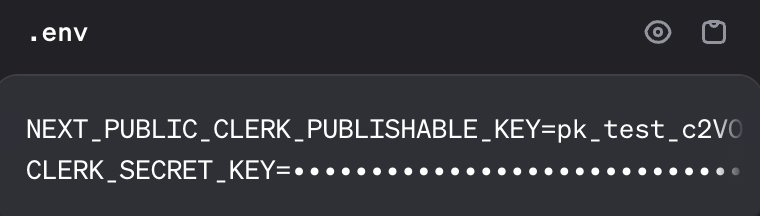

# Next-Js by Codevolution : Part-7 (last part)

### Topics Covered :

- Authentication
- Clerk Setup
- Sign in and Sign out
- Profile Settings
- Conditional UI Rendering
- Protecting Routes
- Read Session and User Data
- Role Based Access Control
- Customizing Clerk Components

## Authentication

- Most apps revolve around users.

- When building for users, we need to consider three fundamental concepts :

    - **Identity** : Verifying who someone is, through authentication.
    - **Sessions** : Keep track of a user's logged-in state across requests.
    - **Access** : Controls what they can do.

- In developers term, we call these authentication, session management and authorization.

- With React single-page apps, you're only dealing with client-side code.

- With Next.js, you've got to protect your app from three different angles: client-side, server-side and API routes.

- When implementing authentication, you will typically want to :

    1. Let users sign up
    2. Give them a way to sign in
    3. Enable them to manage their account (password changes, email updates, etc.)
    4. Show or hide UI elements based on whether they're logged in
    5. Protect certain routes depending on authentication status
    6. Access session and user data when needed
    7. Set up role-based access control (admin, editor, viewer, and so on)
    8. Provide a way to sign out

## Clerk Setup

- Visit `https://clerk.com/` and create an account if you don't have already one.

- Create an application by entering the application name and the methods through which you want your users to login/signup through (GitHub, Google, Email, username, etc).

- After creating an application, choose the framework in which you are building the project on.

- In this case I've selected Next.js

### Steps to integrate Clerk with Next.js

1. Install `@clerk/nextjs` : Run the following command to install the SDK :

```bash
npm install @clerk/nextjs
```

2. **Set your Clerk API keys :** Add these keys to your `.env` or create the file if it doesn't exist. Retrieve these keys anytime from the API keys page.



3. **Update `middleware.ts` :**

- Update your middleware file, or create one at the root of your project, or the `src/ directory` if you're using a `src/ directory` structure.

- The clerkMiddleware helper enables authentication and is where you'll configure your protected routes.

```ts
import { clerkMiddleware } from "@clerk/nextjs/server";

export default clerkMiddleware();

export const config = {
  matcher: [
    // Skip Next.js internals and all static files, unless found in search params
    '/((?!_next|[^?]*\\.(?:html?|css|js(?!on)|jpe?g|webp|png|gif|svg|ttf|woff2?|ico|csv|docx?|xlsx?|zip|webmanifest)).*)',
    // Always run for API routes
    '/(api|trpc)(.*)',
  ],
};
```

4. **Add ClerkProvider to your app :**

- The `ClerkProvidercomponent` provides Clerk's authentication context to your app. It's recommended to wrap your entire app at the entry point with `ClerkProvider` to make authentication globally accessible.

- Copy and paste the following file into your layout.tsx file. This creates a header with Clerk's prebuilt components to allow users to sign in and out.

```tsx
import { type Metadata } from 'next'
import { ClerkProvider } from '@clerk/nextjs'
import { Geist, Geist_Mono } from 'next/font/google'
import './globals.css'

const geistSans = Geist({
  variable: '--font-geist-sans',
  subsets: ['latin'],
})

const geistMono = Geist_Mono({
  variable: '--font-geist-mono',
  subsets: ['latin'],
})

export const metadata: Metadata = {
  title: 'Clerk Next.js Quickstart',
  description: 'Generated by create next app',
}

export default function RootLayout({
  children,
}: Readonly<{
  children: React.ReactNode
}>) {
  return (
    <ClerkProvider>
      <html lang="en">
        <body className={`${geistSans.variable} ${geistMono.variable} antialiased`}>
          {children}
        </body>
      </html>
    </ClerkProvider>
  )
}
```

5. **Create your first user :**

- Run your project. Then, visit your app's homepage at http://localhost:3000 and sign up to create your first user.

```bash
npm run dev
```

## Sign in and Sign out

- The good thing about clerk is that it provides pre-built components that handle all the authentication flows for us.

- You can use `SignInButton` and `SignOutButton` component to Signin or Signout the user.

- Refer `components/navigation.tsx` and `/app/layout.tsx` files.

## Profile Settings 

- We have signin button and signout button components for signing in and signing out.

- But for signing out clerk prrovides even more nicer component called `UserButton` component.

- This component creates an user avatar, by clicking on which it opens a modal, using which we can edit our profiles/account.

- If we want to have a seperate profile page settings page and not a modal, clerk provides us a profile component that we can embed in optional catch-all routes.

### Demo 

```js
// components/navigation.tsx

import { SignInButton, SignOutButton, UserButton } from "@clerk/nextjs";
import Link from "next/link";

export const Navigation = () => {
  return (
    <nav className="bg-[var(--background)] border-b-2 border-[var(--foreground)]/20">
      <div className="max-w-7xl mx-auto px-4 sm:px-6 lg:px-8">
        <div className="flex justify-between h-16 items-center">
          <div className="flex-shrink-0">
            <h1 className="text-xl font-semibold text-[var(--foreground)]">
              Next.js App
            </h1>
          </div>

          <div className="flex items-center gap-4 cursor-pointer">
            {/* Signin button goes here */}
            <SignInButton mode="modal" />
            <SignOutButton />
            <UserButton />
            <Link href={"/user-profile"}>Profile</Link>
          </div>
        </div>
      </div>
    </nav>
  );
};
```

```js
// app/user-profile/[[...user-profile]]/page.tsx

import { UserProfile } from "@clerk/nextjs";

export default function UserProfilePage() {
  return (
    <div className="flex justify-center items-center py-8">
      <UserProfile path="/user-profile" />
    </div>
  );
}
```

## Conditional UI Rendering

- Here we'll be learning how to conditionally render UI elements, based on the user's authentication state.

- Clerk makes this super easy with two special components `SignedIn` and `Signedout` elements.

- Refer `components/navigation.tsx`.

```js
import {
  SignInButton,
  SignOutButton,
  UserButton,
  SignedIn,
  SignedOut,
} from "@clerk/nextjs";
import Link from "next/link";

export const Navigation = () => {
  return (
    <nav className="bg-[var(--background)] border-b-2 border-[var(--foreground)]/20">
        <div className="flex items-center gap-4 cursor-pointer">
            {/* Signin button goes here */}
            <SignedOut>
              <SignInButton mode="modal" />
            </SignedOut>

            <SignedIn>
              <SignOutButton />
              <UserButton />
              <Link href={"/user-profile"}>Profile</Link>
            </SignedIn>
          </div>
    </nav>
  );
};
```